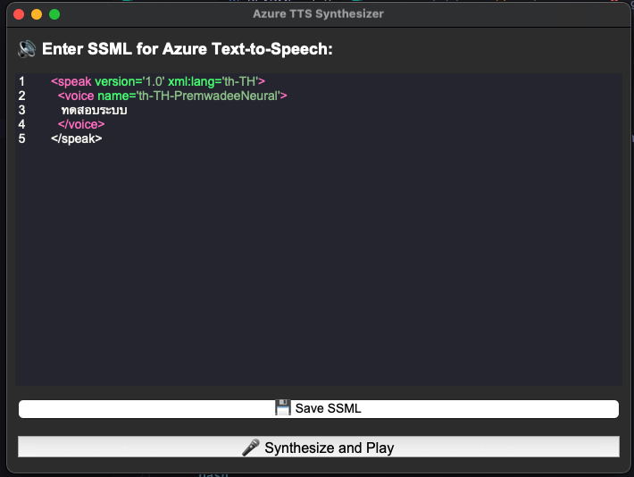

# Azure TTS Synthesizer GUI

A simple GUI application for synthesizing text to speech using Azure TTS via REST API.



## Prerequisites

- Python 3.11
- tkinter
- requests
- chlorophyll
- nava

## Installation

```bash
pip install -r requirements.txt
```

## Usage

```bash
python run.py
```

## Configuration

Create a `config.json` file with the following content:

```json
{
    "AZURE_SPEECH_KEY": "put_your_key_here",
    "AZURE_SPEECH_REGION": "put_your_region_here"
}
```
